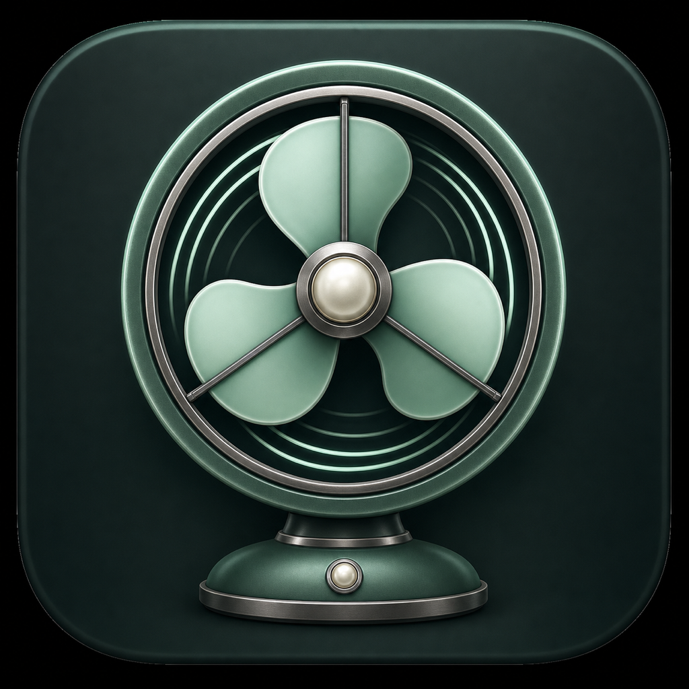
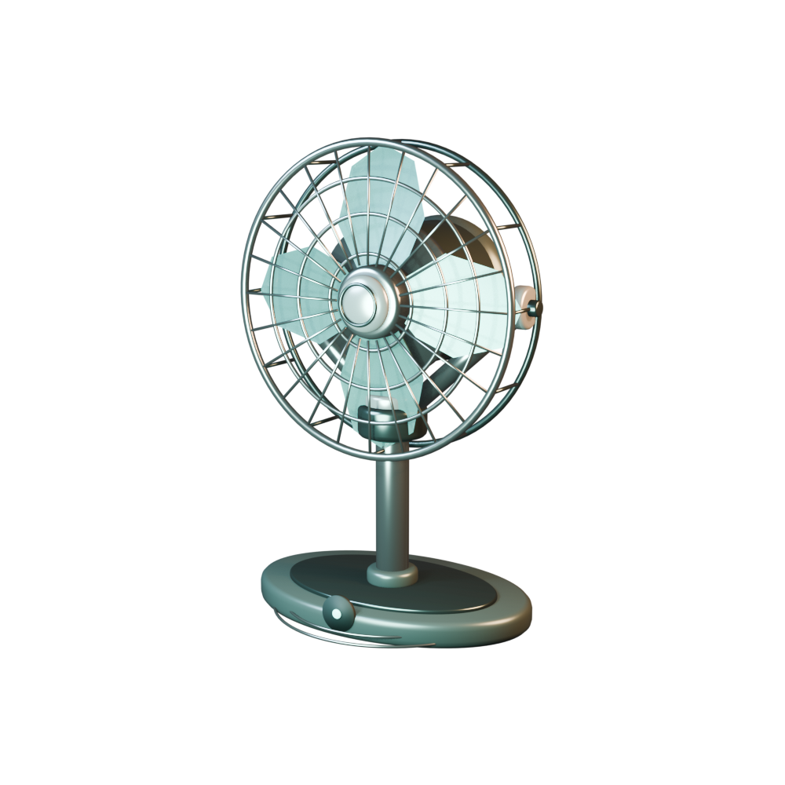

# 风巢 Wind Nest

一款完全在本地运行的 macOS 互动桌面风扇。它使用 Blender 制作的真实三维模型，通过 AppKit、WebKit 和 Three.js 呈现叶片旋转、机头朝向与自然冷风动画，并支持鼠标和摄像头手势控制。

<p align="center">
  
</p>



## 功能

- Blender 三维风扇模型，可从多角度观察
- 三档差异化转速与自然冷风粒子
- 鼠标移动控制机头朝向
- 自动摆头、开关和快捷键控制
- 本机摄像头实时预览与 21 点手部骨架
- 左侧视频画面可独立隐藏，手势识别仍可继续运行
- 握拳关闭、张开手掌启动，伸出 1/2/3 根手指切换档位
- 摄像头画面和手势识别全部在本机处理，不保存、不上传

## 系统要求

- macOS 13.0 或更高版本
- Xcode Command Line Tools
- Node.js 18 或更高版本
- Blender 4.x（仅在重新生成三维模型时需要）

## 构建与运行

```bash
npm ci
chmod +x scripts/build.sh
./scripts/build.sh
open dist/风巢.app
```

首次开启手势控制时，macOS 会请求摄像头权限。本地构建采用临时签名，重新构建后系统可能再次询问权限。

## 交互

- 点击控制栏电源按钮：启动或停止
- `1` / `2` / `3`：选择风速
- `O`：切换自动摆头
- 移动鼠标：控制风扇朝向
- 开启“手势跟随”：显示本机画面并启用手势控制
- 点击“画面”或按 `V`：显示/隐藏左侧视频窗口
- 握拳：关闭风扇
- 张开手掌：启动风扇
- 伸出 1/2/3 根手指：切换一/二/三档
- `H` 或 `Esc`：隐藏或显示控制条
- `Command + Q`：退出

## 重新生成三维模型

```bash
blender --background --python blender/build_fan.py
```

脚本会更新：

- `Resources/assets/wind-nest-fan.blend`
- `Resources/assets/wind-nest-fan.glb`
- `docs/fan-preview.png`

## 项目结构

```text
Sources/main.swift        macOS 窗口、摄像头与 Vision 手势识别
web-src/app.js            Three.js 场景、动画和交互逻辑
Resources/                页面样式、HTML 与三维资产
blender/build_fan.py      Blender 程序化建模脚本
scripts/build.sh          本地应用构建脚本
```

## 隐私

风巢不包含网络请求。摄像头帧只传入 macOS Vision 框架进行本机识别，不写入磁盘，也不会发送到远端服务。

## 许可证

本项目使用 [MIT License](LICENSE) 开源。Three.js 等第三方依赖遵循各自的许可证。
